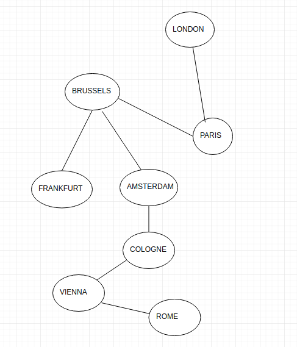
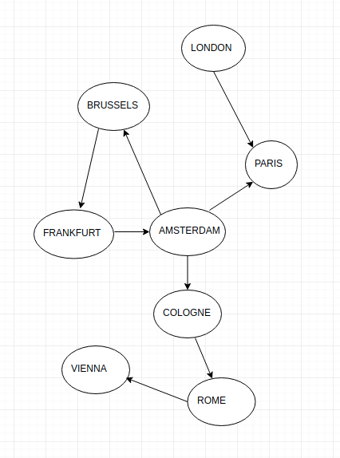

## Graph library

Implementation for working with graph structures and finding paths between vertexes.

Graph library supports 2 graph types:
1. DIRECTED
2. UNDIRECTED

Graph library supports 2 path searching strategies:
1. BFS - Breadth First Search 
2. DFS - Depth First Search 

You can implement and setup graph for using your own strategy.

Graph can be thread safe. 
Use threadSafe flag when you'll create a graph.

#### Tests on strategies for finding paths used those graphs

* Undirected graph, which represents distances between cities:

* Directed graph, which represents distances between cities:

